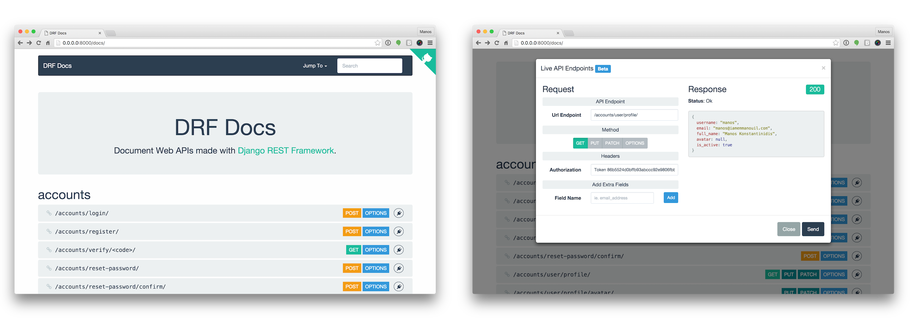

Django REST Framework Docs (DRF Docs) allows you to list all your API Endpoints that inherit from <a href="http://www.django-rest-framework.org/" target="_blank">Django REST Framework</a> **automatically**. Its purpose is to work out of the box and it should take a minimum to install it.

<a class="btn btn-success btn-demo" href="http://demo.drfdocs.com/" target="_blank"><i class="fa fa-laptop"></i> Visit the Demo</a>

#### Live API Endpoints

A really useful feature of DRF Docs is that you can also test endpoints from within the docs. Feel free to use our demo and try them! For more information visit the [Live API Endpoints](/live-api) page of the docs.

#### How It Works

The concept is pretty simple. Once you [install it](/installation/) you should go the the url you set (ie. `http://0.0.0.0:8000/docs/`) and you should see all your API endpoints along with the serializer fields, allowed methods etc for each one.

DRF Docs will then read all your `urls` and will list those that inherit from Django REST Framework's `APIView`.
